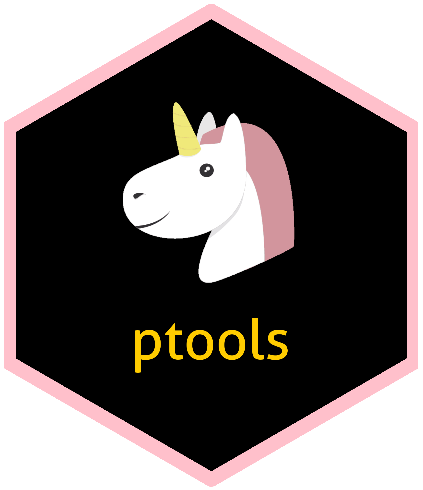

<!-- README.md is generated from README.Rmd. Please edit that file -->

# ptools <a href='https://www.next-decision.fr/'></a>

<!-- badges: start -->

[](https://www.gnu.org/licenses/gpl-3.0.en.html)
[](https://www.tidyverse.org/lifecycle/#experimental)
[](https://travis-ci.com/ND-open/ptools)
[](https://ND-open.github.io/ptools/)
<!-- badges: end -->

<!-- [, Great Truth-orange.svg)](https://github.com/ND-open/ptools/master/DESCRIPTION) blob/master/ -->

### Overview

`ptools` is a package to help you organize your data pipeline project.
Since setting up a project follows recurrent step, a default procedure
is suggested here to save time. The purpose is also to ease project
upgrades and allow unit testing.

  - See the [Get
    Started](https://nd-open.github.io/ptools/articles/ptools.html)
    section for an introduction on how to use this package.
  - Got a idea or bug to report to improve this project ? Please check
    the [github page](https://github.com/ND-open/ptools) and fill an
    issue, PR are welcome \!

### Installation

This package will be not be deployed to CRAN, you need to install it
from github.

``` r
# To install from github you need the package devtools first
if(!require("devtools", character.only = TRUE)){install.packages("devtools")}

# Then you may intall ptools
devtools::install_github("ND-open/ptools")
```

### Organize your projects

The first step of one project is to define what you want to do with your
data. If there are several uses to your data you may want to cut your
project in pieces. Straightforward runs will allow you to get quicker
wins and also to keep your teams (end user, devs,… ) motivated.

By default the following structure is created to keep track of your data
processing :

``` r
# Assuming HDFS organisation
hdfs
|- landing
|- data
    |- raw
    |- intermediate
    |- final
```

  - `landing` : contains only outside raw data that will processed then
    archived. If things goes to worst you will be able to start from
    scratch from there.
  - `data` : your operations starts here, the default here is to process
    only csv files before building Impala or Hive tables.
      - `raw` : for primary operations like processing the extension of
        your data (e.g from json to csv).
      - `intermediate` : optionnal, depending on your pipeline you may
        want to reshape the data or add more cleaning steps.
      - `final` : here will be stored the cleaned data that you want to
        build Impala or Hive tables uppon. The final clean data will be
        automatically converted to Impala (or Hive) tables from the
        final folder(s) on HDFS with the corresponding type. Then you
        may aggregate it using Hadoop.

There are several operations that you cannot perform easily or not at
all in Impala/Hive (such as complex data transformation, reshaping, …).
But you should perform joins using Hadoop to ensure that all the data is
matched with what is intended no matter how delayed this data was
uploaded and insure that your project is viable in time (e.g 5 years
from now your R code might not be optimized to join on much more data).

### Focus on cleaning the data

Thus you can only focus on cleaning your data while not messing with the
`landing folder`. The structure of your pipeline should look like :

``` r
project_name
|- .gitignore
|- data
   |- references.csv
|- documents
   |- meeting_notes.md
|- R
   |- raw_*.R # e.g : raw_to_csv.csv
   |- inter_*.R # e.g : inter_reshape.R 
   |- final_*.R # e.f : final_types
|- project_name.Rproj
|- README.md
|- README.Rmd
|- vignette
   |- report.Rmd
```

  - In the R folder we will find one script per pipeline job. If there
    are more than one step the jobs should be prefixed with a number to
    keep track of the order. You should also add a name saying what the
    job does such as `inter_reshape.R` for an intermediate job than
    takes data from the `raw` folder, reshape it (e.g from long to wide
    format) and write to the `intermediate` folder.
  - In the `data` folder one can put variables dictionnary.
  - The `README.Rmd` file is the minimal documentation for you or a peer
    to retake your project later on.

### To package or not to package

It is your choice to build a package from this structure to ensure
reproducibility and stability of your code in time. You can also source
your script for each pipeline job.

If you rely often on this pipeline or plan to have a stable code in
time, the best thing to do is to package your code (from the structure
above it is to add a `Description` file and compile + debug) and add a
docker file.

### What could be usefull as follow up

  - A way to test your data pipeline and not mess with the source data.
  - A way to automatically document and report on the work you have done
    :
      - how the data was gathered
      - data transformation and stats on cleanness / missingness
      - joins performed
  - Tools to audit your pipelines :
      - How to set up daily report on the action performed and their
        quality.
