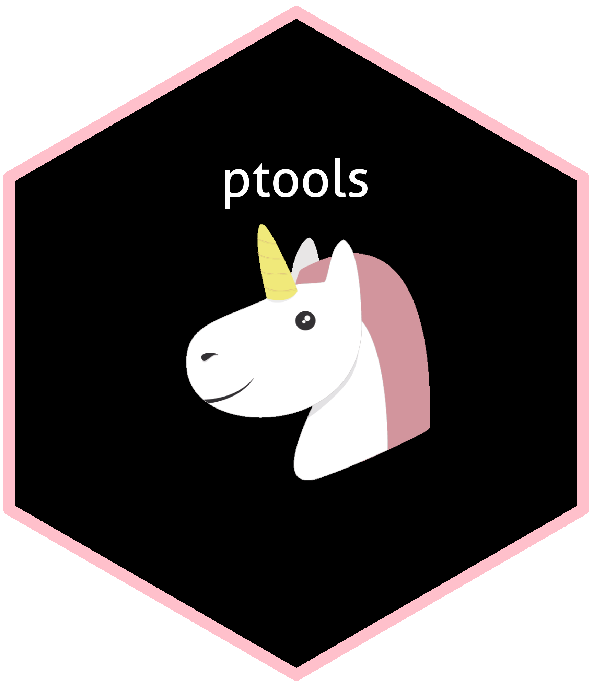

```{r setup, include=FALSE}
knitr::opts_chunk$set(echo = FALSE)
```

<!-- README.md is generated from README.Rmd. Please edit that file -->

```{r, include = FALSE}
knitr::opts_chunk$set(
  collapse = TRUE,
  comment = "#>",
  fig.path = "man/figures/README-",
  out.width = "100%"
)
options(tibble.print_min = 5, tibble.print_max = 5)
```

```{r, echo=FALSE, out.width="200px"}

```


```{r, echo=FALSE, out.width="250px"}
# knitr::include_graphics("https://raw.githubusercontent.com/ThinkR-open/thinkr/master/inst/img/thinkr-hex-thinkr-package.png")
```

```{r echo=FALSE, prompt=FALSE, results='asis', comment=""}

# install.packages("usethis", lib = "lib_local")
# install.packages("clisymbols", lib = "lib_local")
# library(usethis, lib.loc = "lib_local")
# library(clisymbols, lib.loc = "lib_local")
# usethis::use_lifecycle_badge("Experimental")

# cat('
#   [](https://img.shields.io/badge/lifecycle-experimental-orange.svg)
# ')

cat("[](https://www.tidyverse.org/lifecycle/#experimental)"
)

```

to come : hex logo using GuangchuangYu/hexSticker pkg

## Overview

dftools is a package to help you organize your data pipeline project. Since setting up a project follows always the same step, a default procedure is suggested here to save time. The purpose is also to ease project upgrades and allow unit testing.

Reporting on the project construction is also important, tools to achive this will be developped in the future.

## Installation

```{r, eval = FALSE}
# To install from github you need the package devtools first
if(!require("devtools")){install.packages("devtools")}

# Then you may intall dftools
devtools::install_github("goodfr/dftools")
```


## Default scheme

To that end the following organization is used by default.

```{r}
# something awesome should come here.
```


## Setting up a new scheme

```{r}
# Future step of developpement.
```


## Report on the work you have done

Explain how the project was built :

* how the data was gathered
* data transformation and stats on cleanness / missingness
* joins performed

Follow up :

* How to set up daily report on the action performed and their quality.


